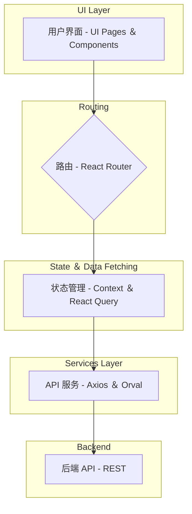
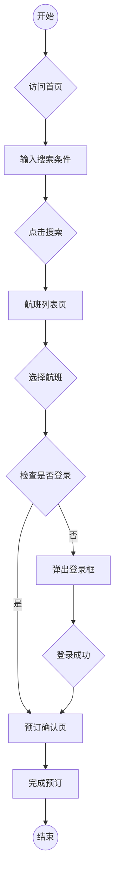

# 航空订票平台 - 前端 (Flight Client)

## 简介

本项目是航空订票平台的前端部分，基于 React 和 Vite 构建。它为用户提供了一个查询、选择和预订航班的现代化、响应式的用户界面。项目采用前后端分离架构，通过 REST API 与后端服务进行通信。

## 功能特性

- **航班搜索**：支持单程和往返航班的搜索，可根据出发地、目的地、日期和乘客人数进行筛选。
- **航班列表与筛选**：清晰展示航班信息，包括航司、时间、价格和中转信息，并支持排序。
- **用户认证**：提供用户注册和登录功能，使用 JWT 进行状态管理。
- **订单管理**：登录用户可以查看和管理自己的历史订单和未来行程。
- **响应式设计**：适配 PC 和移动设备，提供一致的用户体验。
- **国际化**：支持中英文切换。

## 技术栈

- **框架**: [React](https://react.dev/) + [Vite](https://vitejs.dev/)
- **路由管理**: [React Router Dom](https://reactrouter.com/en/main)
- **状态管理**: [React Context](https://react.dev/reference/react/useContext) & [TanStack Query (React Query)](https://tanstack.com/query/latest)
- **UI & 样式**: [Tailwind CSS](https://tailwindcss.com/)
- **HTTP 请求**: [Axios](https://axios-http.com/)
- **API 代码生成**: [Orval](https://orval.dev/)
- **日期处理**: [Day.js](https://day.js.org/)
- **通知/弹窗**: [React Toastify](https://fkhadra.github.io/react-toastify/introduction/)
- **加载占位**: [React Loading Skeleton](https://www.npmjs.com/package/react-loading-skeleton)
- **国际化**: [i18next](https://www.i18next.com/) & [react-i18next](https://react.i18next.com/)

## 项目架构

项目采用模块化的分层架构，将不同的功能逻辑分离到独立的目录中，以提高代码的可维护性和可复用性。



## 主要业务流程

下图展示了用户从搜索航班到完成预订的核心业务流程。



## 目录结构

```
flight-client/
├── public/               # 静态资源
├── src/
│   ├── api/              # Orval 生成的 API 代码和 Axios 实例
│   ├── assets/           # 图片、图标等资源
│   ├── components/       # 可复用的 UI 组件
│   ├── context/          # React Context (全局状态管理)
│   ├── hooks/            # 自定义 Hooks
│   ├── i18n/             # 国际化配置和语言文件
│   ├── pages/            # 页面级组件
│   ├── router/           # 路由配置
│   ├── services/         # 遗留的 API 服务 (建议迁移到 api/)
│   ├── App.tsx           # 应用根组件
│   └── main.tsx          # 应用入口文件
├── .env                  # 环境变量
├── package.json          # 项目依赖和脚本
└── vite.config.ts        # Vite 配置文件
```

## 快速开始

### 1. 环境准备

- [Node.js](https://nodejs.org/) (>= 18.x)
- [pnpm](https://pnpm.io/) (推荐) 或 npm/yarn

### 2. 克隆项目

```bash
git clone <repository-url>
cd flight-client
```

### 3. 安装依赖

```bash
pnpm install
```

### 4. 配置环境变量

复制 `.env.development` 文件并重命名为 `.env.local`。根据你的后端服务地址修改 `VITE_API_URL`。

```
VITE_API_URL=http://localhost:8080
```

### 5. 运行项目

```bash
pnpm dev
```

项目将在 `http://localhost:3000` (或指定的端口) 上运行。

### 6. 生成 API 客户端

如果后端 API 有更新，可以运行以下命令重新生成类型安全的 API 客户端代码：

```bash
pnpm orval
```
