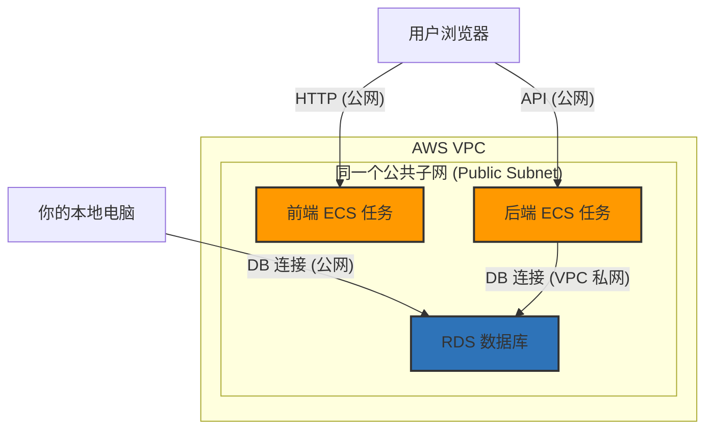

# 航班预订应用 AWS ECS 部署指南 (简化练习版)

本文档旨在指导您完成一个前后端分离应用在 AWS ECS (Fargate) 上的简化部署。本指南专为培训练习设计，将省略生产环境中的某些复杂组件（如 Application Load Balancer），让您专注于核心的容器化部署流程。

## 1. 最终架构概览

我们的目标是搭建如下架构。所有资源都位于同一个 VPC 和公共子网中，以便于访问和调试。



## 2. 核心原则与网络配置

为了避免 `connection failed` 错误，以下网络配置是本次部署成功的关键：

- **VPC**: 所有资源（ECS, RDS）都使用**同一个 VPC**（推荐使用默认 VPC）。
- **子网**: 所有资源都部署在**公共子网 (Public Subnets)** 中，并确保这些子网关联的路由表有指向互联网网关 (IGW) 的路由。
- **公有 IP**: 在创建 ECS 服务时，必须为前端和后端任务**启用公有 IP (Enable Public IP)**。
- **安全组 (Security Groups)**: 这是最重要的部分。我们将创建三个独立的安全组，规则如下：

---

### 安全组配置详解

**重要**: 安全组**名称 (Group Name)** 不能以 `sg-` 开头。以下是推荐的合规命名。

#### `lzg-flightclient-sg` (前端安全组)

- **目标**: 允许用户通过浏览器访问您的网站。
- **入站规则 (Inbound Rules)**:
  | 类型 | 协议 | 端口范围 | 来源 | 描述 |
  | :--- | :--- | :--- | :--- | :--- |
  | HTTP | TCP | 80 | `0.0.0.0/0` | 允许来自任何地方的 HTTP 访问 |

#### `lzg-flightapi-sg` (后端安全组)

- **目标**: 允许浏览器调用后端 API。
- **入站规则 (Inbound Rules)**:
  | 类型 | 协议 | 端口范围 | 来源 | 描述 |
  | :--- | :--- | :--- | :--- | :--- |
  | 自定义 TCP | TCP | 8080 | `0.0.0.0/0` | 允许来自任何地方的 API 调用 |

#### `lzg-flightdb-sg` (RDS 数据库安全组)

- **目标**: 允许后端服务和您的本地电脑访问数据库。
- **入站规则 (Inbound Rules)**:
  | 类型 | 协议 | 端口范围 | 来源 | 描述 |
  | :--- | :--- | :--- | :--- | :--- |
  | MySQL/Aurora | TCP | 3306 | `lzg-flightapi-sg` | **[关键]** 允许后端服务通过私网 IP 访问 |
  | MySQL/Aurora | TCP | 3306 | `你的本地公网IP/32` | **[关键]** 允许您从本地电脑调试数据库 |

> **注意**: 请将 `你的本地公网IP/32` 替换为您的真实公网 IP。

---

## 3. 详细部署步骤

### 阶段一：基础设施准备

1.  **创建 RDS 数据库**:
    - 在 AWS RDS 控制台创建一个 MySQL 数据库实例。
    - **网络配置**: 确保将其放置在您的目标 VPC 和**公共子网**中。
    - **安全**: 创建并关联 `lzg-flightdb-sg` 安全组，并按照上表配置好入站规则。
    - **初始化**: 使用您的本地数据库工具（通过公网 IP）连接到 RDS，创建数据库表并导入初始数据。

### 阶段二：后端部署

2.  **构建与测试**:
    - 在本地执行 `./mvnw clean package -DskipTests` 打包应用。
    - **本地测试**:
      - 确保您的 `.env` 文件已配置好指向 AWS RDS 的 `DB_URL`, `DB_USERNAME`, 和 `DB_PASSWORD`。
      - 运行 `docker-compose up --build`。此命令会自动构建镜像并加载 `.env` 文件中的所有环境变量来启动容器。
      - 检查日志，确认应用能成功启动并连接到 AWS 上的 RDS 数据库。
3.  **推送镜像至 ECR**:
    - 在 AWS ECR 控制台创建一个名为 `flight-api` 的私有仓库。
    - 按照 ECR 提供的推送命令，为 `flight-api:latest` 镜像打标签并推送到仓库。
4.  **部署至 ECS**:
    - 创建一个 ECS 集群。
    - 创建一个 ECS **任务定义 (Task Definition)**：
      - 容器镜像：指定您刚刚推送到 ECR 的镜像 URL。
      - 端口映射：容器端口 `8080`。
      - **环境变量**: 设置 `DB_URL`, `DB_USERNAME`, `DB_PASSWORD`, 和 `JWT_SECRET`。
    - 创建一个 ECS **服务 (Service)**：
      - 关联上述任务定义。
      - **网络**: 选择您的 VPC 和**公共子网**。
      - **公有 IP**: **务必选择“启用 (Enabled)”**。
      - **安全组**: 关联 `lzg-flightapi-sg`。

### 阶段三：前端部署

5.  **获取后端 IP**: 后端服务运行后，在 ECS 控制台找到其任务的**公有 IP 地址**。
6.  **本地集成测试与构建 (推荐)**:
    - 为了在部署到云端前进行最真实的测试，我们强烈建议使用 Docker Compose 在本地完整地构建和运行前后端容器。
    - **操作流程**:
      1. **创建共享网络 (一次性操作)**: 如果您尚未创建，请运行以下命令。
         ```bash
         docker network create flight-net
         ```
      2. **构建并启动服务**: 在 `flight-client` 目录下，运行以下命令。
         ```bash
         docker-compose up --build --force-recreate
         ```
         - `--build`: 此标志会强制 Docker Compose 根据最新的代码（包括后端的 `.jar` 包和前端的所有文件）重新构建镜像，替代了过去手动的 `docker build` 命令。
         - `--force-recreate`: 确保容器被重建，以应用所有最新的配置和镜像。
    - **验证**:
      - 检查日志，确保前后端服务都已成功启动。
      - 在浏览器中打开 `http://localhost`，并测试核心功能（如登录、搜索航班），确认与后端 API 的交互正常。
    - **清理**: 测试完成后，运行 `docker-compose down` 停止并移除容器。
7.  **推送镜像至 ECR**:
    - 测试通过后，本地的 `flight-client:latest` 和 `flight-api:latest` 就是我们准备推送到云端的镜像。
    - 在 ECR 中分别为 `flight-client` 和 `flight-api` 创建仓库，并按照 ECR 控制台的指引推送这两个镜像。
8.  **部署至 ECS**:
    - 在**同一个 ECS 集群**中，创建新的**任务定义 (Task Definition)**。
      - **容器镜像**: 指定您刚刚推送到 ECR 的 `flight-client` 镜像 URL。
      - **端口映射**: 容器端口 `80`。
      - **[关键] 环境变量**: 添加一个环境变量，用于将后端服务的地址注入到前端容器中。
        - **键**: `VITE_API_BASE_URL`
        - **值**: `http://<后端公有IP>:8080`
    - 创建一个新的 ECS **服务 (Service)**。
      - **关联任务定义**: 选择您刚刚创建并配置好环境变量的任务定义。
      - **网络**: 选择相同的 VPC 和**公共子网**。
      - **公有 IP**: **务必选择“启用 (Enabled)”**。
      - **安全组**: 关联 `lzg-flightclient-sg`。

### 阶段四：最终验证

1.  **获取前端 IP**: 前端服务运行后，获取其任务的**公有 IP 地址**。
2.  **测试**: 在浏览器中打开 `http://<前端公有IP>`。
3.  验证所有功能是否正常，特别是那些需要调用后端 API 的功能（如搜索航班）。此时，CORS 配置 (`allowedOriginPatterns: *`) 会确保浏览器请求不会被阻止。

祝您部署顺利！

---

## 4. 本地开发与调试工作流

在本地开发或修复 Bug 时，推荐遵循以下标准流程来确保环境的纯净和配置的正确加载。

### 问题：Swagger UI 资源加载失败

- **现象**: 应用启动后，访问 Swagger UI 页面时，页面无法正常渲染，浏览器控制台或后端日志出现 `NoResourceFoundException`，提示找不到 `swagger-ui.css` 等静态资源。
- **根本原因**: Spring Security 配置不完整，拦截了对 Swagger UI 某些路径的访问，特别是 `/swagger-ui.html` 这个重定向路径。

### 标准修复流程

1.  **清理旧环境**: 如果有正在运行的应用，先将其彻底关闭和清理。

    ```bash
    docker-compose down
    ```

    _此命令会停止并移除相关的容器和网络。_

2.  **修改代码**:

    - **定位问题**: 根据错误日志，定位到问题源于 `SecurityConfig.java`。
    - **进行修复**: 在 `SecurityConfig` 的 `requestMatchers` 列表中，添加对 `/swagger-ui.html` 的许可。

3.  **重新打包应用**: 由于修改了 Java 源代码，需要重新生成 `.jar` 包。

    ```bash
    ./mvnw clean package -DskipTests
    ```

4.  **重新构建并启动**: 使用 `docker-compose` 以确保所有配置（包括 `.env` 文件）都被正确加载。

    ```bash
    docker-compose up --build
    ```

    _`--build` 标志会强制 Docker 根据最新的 `.jar` 包重新构建镜像。_

5.  **验证修复**: 访问 `http://localhost:8080/swagger-ui.html`，确认问题已解决。

这个流程确保了每次测试都是在一个基于最新代码和配置的、干净的环境中进行的。

---

## 5. 故障排查案例：ECS 无法连接 RDS

本章节记录一次真实的故障排查过程，旨在为未来的部署问题提供参考。

### 现象

- **本地测试成功**: 在本地使用 `docker-compose up --build` 启动后端服务，应用能够成功连接到 AWS RDS 数据库并查询数据。
- **ECS 部署失败**: 将完全相同的镜像部署到 ECS 后，通过公网 IP 调用 API 时，返回 `500 Internal Server Error`。
- **ECS 日志分析**: 查看 ECS 任务日志，发现大量 `org.hibernate.exception.JDBCConnectionException` 和 `com.mysql.cj.exceptions.CJCommunicationsException` 错误，根本原因指向 `java.net.ConnectException: Connection refused`。

### 初步排查（错误的假设）

根据“Connection refused”的典型特征，初步怀疑是网络连接问题，焦点放在了 **RDS 的安全组 (`lzg-flightdb-sg`)** 上。

- **假设**: RDS 的安全组没有正确地允许来自后端 ECS 服务安全组 (`lzg-flightapi-sg`) 的流量。
- **尝试**: 反复检查和修改 RDS 安全组的入站规则，例如，将来源从 `0.0.0.0/0` 修改为具体的安全组 ID 引用。
- **结果**: **问题依旧**。即使安全组规则配置得非常标准和正确，ECS 任务依然无法连接数据库。这证明问题根源不在于网络防火墙层面。

### 根本原因定位

重新仔细审查 ECS 任务的启动日志，发现了一条关键信息：

```
INFO --- [main] c.e.flightapi.FlightApiApplication : The following 1 profile is active: "dev"
```

这表明在 ECS 上运行的应用错误地加载了**开发环境 (`dev`)** 的配置。

- **原因分析**:
  1.  当应用以 `dev` profile 运行时，它会加载 `application.yml` 文件，该文件中的数据库 URL 指向 `localhost:3306`。
  2.  在 ECS 容器环境中，`localhost` 指的是容器自身，而不是远端的 RDS 数据库，因此连接必然被拒绝。
  3.  本地 `docker-compose` 之所以能成功，是因为 `docker-compose.yml` 文件中明确指定了 `SPRING_PROFILES_ACTIVE=prod`，强制应用加载了 `application-prod.yml`，并正确地使用了通过环境变量传入的 RDS 数据库连接信息。
  4.  在初次创建 ECS 任务定义时，**遗漏了设置 `SPRING_PROFILES_ACTIVE` 这个关键的环境变量**。

### 解决方案

1.  **编辑 ECS 任务定义**: 进入 AWS 控制台，为后端的 ECS 任务定义创建一个新版本。
2.  **添加环境变量**: 在环境变量部分，添加一个新的键值对：
    - **键**: `SPRING_PROFILES_ACTIVE`
    - **值**: `prod`
3.  **更新 ECS 服务**: 将服务更新到使用这个最新的任务定义版本，并强制进行一次新部署。

### 核心教训

- **环境一致性是关键**: 确保部署到云端的应用与本地测试时使用**完全相同的配置 Profile**。任何一个环境变量的遗漏都可能导致难以排查的运行时错误。
- **日志是最终真相**: 当遇到问题时，应仔细、完整地阅读应用的启动日志。`profile is active: "dev"` 这样一行看似普通的信息，却是解开谜题的钥匙。
- **不要过早下结论**: 虽然网络问题（如安全组）是云部署中最常见的错误来源，但在安全组配置看起来正确却问题依旧时，必须转换思路，深入检查应用本身的配置和启动参数。

---

## 6. 故障排查案例：修复生产环境的 CORS 配置

本章节记录一次在本地 Docker Compose 测试环境中发现，但在开发环境中并未出现的 CORS 配置问题。

### 现象

- **开发环境正常**: 在本地直接运行前端（Vite）和后端（Spring Boot）进行开发联调时，跨域请求一切正常。
- **Docker Compose 测试失败**: 使用 `docker-compose up` 启动集成了前端和后端的测试环境后，浏览器访问前端页面时，API 调用失败。
  - **前端浏览器报错**: `Access to XMLHttpRequest at 'http://localhost:8080/api/...' has been blocked by CORS policy: No 'Access-Control-Allow-Origin' header is present on the requested resource.`
  - **后端容器日志报错**: `java.lang.IllegalArgumentException: When allowCredentials is true, allowedOrigins cannot contain the special value "*" ...`

### 问题分析与定位

1.  **环境差异是关键**: 开发环境与 Docker Compose 测试环境（加载了 `prod` Profile）的核心差异在于**后端加载的配置不同**。
2.  **后端日志揭示真相**: 后端的 `IllegalArgumentException` 明确指出，当 Spring Security 的 CORS 配置中启用了凭证支持 (`allowCredentials(true)`) 时，出于安全原因，不允许将允许的来源 (`allowedOrigins`) 设置为通配符 `*`。
3.  **开发环境为何正常？**:
    - 可能性一：开发环境的 Profile (`dev`) 可能加载了另一套更具体的 CORS 配置，例如 `allowedOrigins("http://localhost:5173")`，从而避免了冲突。
    - 可能性二：开发时使用了 Vite 的代理 (`server.proxy`)，请求被 Vite 服务器转发，对后端来说并非跨域请求，因此绕过了浏览器的 CORS 检查。

### 解决方案

问题的根源在于后端 `prod` 环境的 CORS 配置不当。

1.  **定位配置文件**: 找到后端的 `SecurityConfig.java` 文件。
2.  **修改 CORS 配置**: 在 `corsConfigurationSource` Bean 的定义中，将 `.setAllowedOrigins(...)` 修改为 `.setAllowedOriginPatterns(...)`。

    ```java
    // 错误的方式
    // configuration.setAllowedOrigins(Arrays.asList(allowedOrigins));

    // 正确的方式
    configuration.setAllowedOriginPatterns(Arrays.asList(allowedOrigins));
    ```

3.  **重新打包并构建**:
    - 修改 Java 代码后，必须重新打包后端应用：`./mvnw clean package -DskipTests`。
    - 然后使用 `docker-compose up --build` 重新构建后端镜像并启动服务。

### 核心教训

- **生产环境配置必须严格测试**: 不要想当然地认为开发环境的配置可以直接用于生产。不同的 Profile 可能会加载截然不同的配置，导致只在特定环境下才出现问题。
- **后端日志是第一现场**: 前端报送的 CORS 错误通常是表象，真正的错误原因需要深入分析后端服务的日志。`IllegalArgumentException` 这类由配置不当引发的异常是定位问题的最直接线索。
- **理解 CORS 策略**: 深刻理解 `allowCredentials` 和 `allowedOrigins` 之间的关系是避免此类问题的关键。当需要支持 Cookie 或其他凭证时，必须明确指定允许的来源，或使用 `allowedOriginPatterns` 这种更灵活的模式。

---

## 7. 故障排查案例：修复 SPA 路由的 404 错误

本章节记录单页应用（SPA）在 Nginx 部署时遇到的一个典型问题：直接访问子路径时出现 `404 Not Found`。

### 现象

- **应用内导航正常**: 在应用内部通过点击链接（如从首页跳转到登录页）进行导航时，一切正常。
- **直接访问或刷新失败**: 当在浏览器地址栏中直接输入 `http://<your-ip>/login` 或 `http://<your-ip>/register` 并按回车，或者在这些子页面上刷新时，服务器返回 `404 Not Found` 错误。

### 问题分析与定位

这个问题的根源在于**服务器端路由**和**客户端路由**的冲突。

1.  **客户端路由 (Client-Side Routing)**:

    - 我们的 React 应用使用 `react-router-dom` 来管理路由。当你在应用内点击一个 `<Link>` 时，React Router 会在浏览器内部处理这个导航，它会更新 URL，然后渲染对应的组件，但**不会向服务器发送新的页面请求**。

2.  **服务器端路由 (Server-Side Routing)**:
    - 当你直接在浏览器中访问 `http://<your-ip>/login` 时，浏览器会向服务器（Nginx）发送一个 `GET /login` 的请求。
    - 在默认情况下，Nginx 会尝试在它的网站根目录中寻找一个名为 `login` 的文件或目录。
    - 由于我们的项目是一个单页应用，所有逻辑都在 `index.html` 和相关的 JS 包里，服务器上并不存在一个物理的 `login` 文件。因此，Nginx 找不到请求的资源，只能返回 404。

### 解决方案

解决方案是修改 Nginx 配置，告诉它如何处理这些它不认识的路径，让它把所有这类请求都交给我们的 React 应用来处理。

1.  **定位配置文件**: `nginx.conf`。
2.  **修改配置**: 在 `server` 块的 `location /` 指令中，添加 `try_files` 规则。

    ```nginx
    location / {
        # 尝试按顺序查找文件：
        # 1. $uri: 查找与请求完全匹配的文件 (e.g., /assets/logo.png)
        # 2. $uri/: 查找与请求匹配的目录 (e.g., /static/)
        # 3. /index.html: 如果都找不到，则返回 /index.html
        try_files $uri $uri/ /index.html;
    }
    ```

3.  **工作原理**:
    - 当 Nginx 收到一个对 `/login` 的请求时，它首先尝试查找 `/login` 文件和 `/login/` 目录，均失败。
    - `try_files` 指令的最后一部分 ` /index.html` 此时生效，它告诉 Nginx：“不要返回 404，而是返回 `index.html` 的内容。”
    - 浏览器接收到 `index.html` 后，开始加载 React 应用。
    - React Router 启动，检查到当前 URL 是 `/login`，于是它会渲染 `<LoginPage>` 组件。
    - 这样，用户就看到了正确的页面，问题解决。

### 核心教训

- **SPA 部署的普遍问题**: 任何基于客户端路由的单页应用（无论是 React, Vue, 还是 Angular）在部署时都会遇到这个问题。
- **服务器配置是关键**: 必须正确配置 Web 服务器（如 Nginx, Apache），使其能够将所有页面路由请求都“重定向”到应用的单一入口文件 (`index.html`)，由客户端路由库接管后续处理。
